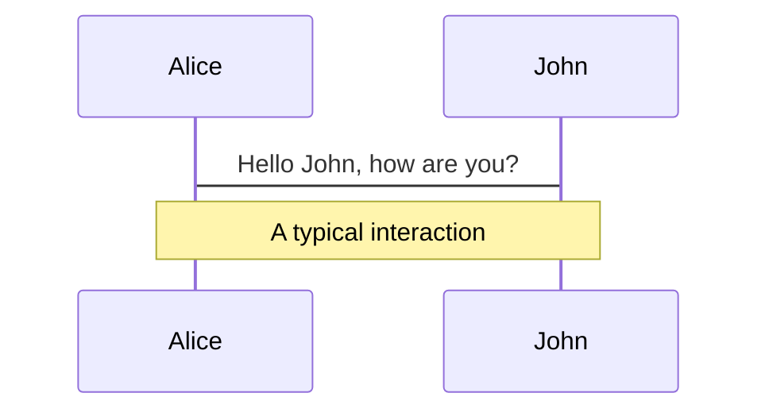
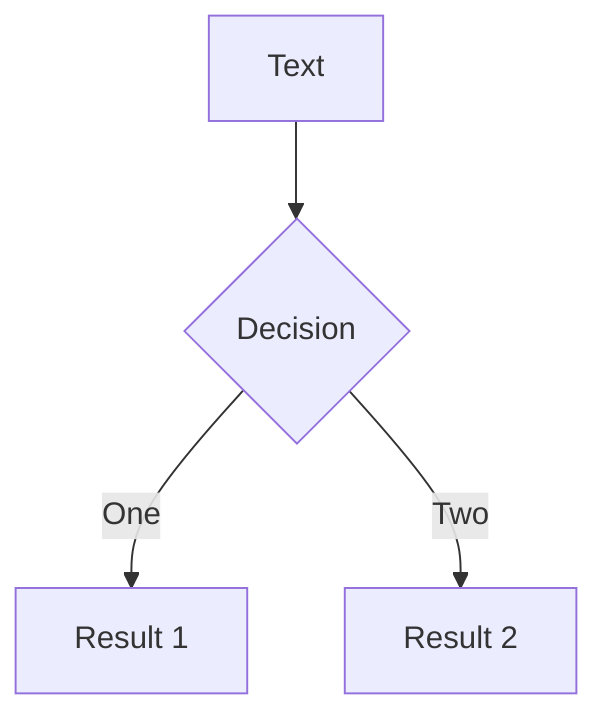

---
# try also 'default' to start simple
theme: seriph
# random image from a curated Unsplash collection by Anthony
# like them? see https://unsplash.com/collections/94734566/slidev
background: https://source.unsplash.com/collection/94734566/1920x1080
# apply any windi css classes to the current slide
class: 'text-center'
# https://sli.dev/custom/highlighters.html
highlighter: shiki
download: true
---

# Apache Druid and Imply

Gaétan Collaud

22nd June 2021

<a href="https://github.com/gaetancollaud/presentations" target="_blank" alt="GitHub"
  class="abs-br m-6 text-xl icon-btn opacity-50 !border-none !hover:text-white">
  <carbon-logo-github />
</a>

---
layout: image-right
image: https://source.unsplash.com/collection/94734566/1920x1080
---

# Summary

- **Apache Druid** - Database for analytics
- **Imply** - The Confluent of Apache Druid
- **Imply Pivot** - The visualisation tool of Imply
- **Apache Superset** - Alternative to Pivot
- **Demo** - Show me some data !
- **Questions** - I'm sure you have one

---
layout: image-left
image: https://s01.sgp1.cdn.digitaloceanspaces.com/article/124353-huqumrjvmo-1563950293.jpg
---

# Context

Sales analytics

Our customer has 1k+ shops with 300k+ products and do sales predictions every week.

They currently do analytics with excel...

Which is ... kinda slow ...

So they make aggregation (for instance they group all the milk related products)

---

# Apache druid

"Apache Druid is a high performance real-time analytics database."

Druid is composed of multiple services and each services has it's defined scope

SQL query language

Immutable data coming from different sources (makes copy)

Goal is to answer to any query (even multiple Terra Bytes) under one second

Joins possible, but limited and relatively slow. It's best to flatten the data

Index everything ! Each dimension has its own dictionary

Not that easy to setup...

---

# Apache Druid Architecture

---
layout: image-right
image: https://source.unsplash.com/collection/94734566/1920x1080
---

# Under the hood

segmentation/partition => Same as kafka 

Time based but can also be split on a dimension.

"Perfect" segment is around 700mb

Rollout => "compact" the data

Time base eviction

Currently, join table are in memory (limitation)

---
layout: image-right
image: https://source.unsplash.com/collection/94734566/1920x1080
---

# Imply

Confluent, know them ?

Imply is like confluent

but for Apache Druid and not kafka

Main contributor of Apache Druid

Products:
* Imply Pivot
* Imply Clarity
* Imply Manager
* Imply Cloud

---

# Imply pivot

---
layout: image-right
image: https://www.datocms-assets.com/11147/1560871552-screenshot-dashboard.png
---

# Imply pivot

Rapid data exploration

Every change trigger a query

Was open source:
 * https://github.com/implydata/pivot

Forks can be found:
 * https://github.com/allegro/turnilo

Demo later ;)

---

# Apache superset

---
layout: image-right
image: https://superset.apache.org/images/dashboard3.png
---

# Apache superset

100% Opensource

Supports a lot of databases (including Apache Druid)

Supports a lot of different visualizations

Edit mode - View mode

Very customizable
* CSS customization
* plugin development

Demo later ;)

---

# LaTeX

LaTeX is supported out-of-box powered by [KaTeX](https://katex.org/).

 

Inline $\sqrt{3x-1}+(1+x)^2$

Block
$$
\begin{array}{c}

\nabla \times \vec{\mathbf{B}} -\, \frac1c\, \frac{\partial\vec{\mathbf{E}}}{\partial t} &
= \frac{4\pi}{c}\vec{\mathbf{j}}    \nabla \cdot \vec{\mathbf{E}} & = 4 \pi \rho \\

\nabla \times \vec{\mathbf{E}}\, +\, \frac1c\, \frac{\partial\vec{\mathbf{B}}}{\partial t} & = \vec{\mathbf{0}} \\

\nabla \cdot \vec{\mathbf{B}} & = 0

\end{array}
$$

 

[Learn more](https://sli.dev/guide/syntax#latex)

---

# Diagrams

You can create diagrams / graphs from textual descriptions, directly in your Markdown.

[Learn More](https://sli.dev/guide/syntax.html#diagrams)

---
layout: center
class: text-center
---

# Learn More

[Documentations](https://sli.dev) / [GitHub Repo](https://github.com/slidevjs/slidev)
