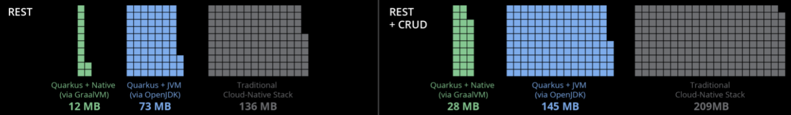
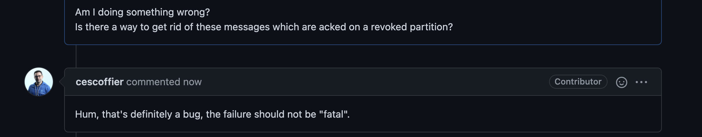

# Quarkus

Gaétan Collaud

20th July 2021

<a href="https://github.com/gaetancollaud/presentations" target="_blank" alt="GitHub"
class="abs-br m-6 text-xl icon-btn opacity-50 !border-none !hover:text-white">
<carbon-logo-github />
</a>

---
layout: image-right
image: https://source.unsplash.com/1920x1080/weekly?code
---

# Summary

  - What is Quarkus ?
  - Why Quarkus ?
  - AOT
  - GraalVM and native build
  - Extensions
  - Reactive
  - Community
  - Agoora and Quarkus
  - Questions

---

# What is Quarkus ?

### Official short description

> CONTAINER FIRST
> 
> Quarkus tailors your application for GraalVM and HotSpot. Amazingly fast boot time, incredibly low RSS memory (not just heap size!) offering near instant scale up and high density memory utilization in container orchestration platforms like Kubernetes. We use a technique we call compile time boot. Learn more.

<br />
<br />

### In summary
 * Designed for k8s
 * AOT compilation and native image
 * Fast boot, fast scale
 * Low memory usage
 * Live reload when in development

<br />
<br />

```
sdm-hooks native (powered by Quarkus 1.13.7.Final) started in 0.042s
```

---

# Why Quarkus ?


Come on, another one  ?!


Yes but from Red Hat !
 * Tailored for Enterprises
 * Based on Microprofile, Vert.x and others
 * Follows java standards (Java EE, JAX-RS, ...)
 * Best of best when it comes to extensions (more later)
 * Best suited for k8s (ex: liveness and readiness)


---

# AOT


---

# GraalVM and native build (1/2)

* Allows you to generate a binary (no jvm needed anymore)
* "Three shaking" (Remove everything that is not needed during compile time)
* No reflexion allowed ! (There is a workaround)

```java
// This will be used by jackson using reflexion
@RegisterForReflection
public class SwisscomLoraRequest {
```
* Extremely fast to boot and very low memory usage
  

---

# GraalVM and native build (2/2)
* Native compilation is heavy and slow
```
[sdm-activities-1.0.0-SNAPSHOT-runner:27]    classlist:   2,715.23 ms,  1.69 GB
[sdm-activities-1.0.0-SNAPSHOT-runner:27]        (cap):     335.44 ms,  1.69 GB
[sdm-activities-1.0.0-SNAPSHOT-runner:27]        setup:   1,871.82 ms,  1.69 GB
...
[sdm-activities-1.0.0-SNAPSHOT-runner:27]    (compile):  35,773.89 ms,  9.24 GB
[sdm-activities-1.0.0-SNAPSHOT-runner:27]      compile:  81,756.04 ms,  9.24 GB
[sdm-activities-1.0.0-SNAPSHOT-runner:27]        image:  24,645.09 ms,  8.67 GB
[sdm-activities-1.0.0-SNAPSHOT-runner:27]        write:   2,088.35 ms,  8.62 GB
[sdm-activities-1.0.0-SNAPSHOT-runner:27]      [total]: 346,400.14 ms,  8.62 GB
```
* Less throughput than JVM ! No JIT optimisation available

|   | Host | Docker  | 
|---|---|---|
| JVM | 1'776'120 event/sec | 2'016'174 event/sec |
| Native | 790'183 event/sec | 776'759 event/sec |

Interesting article: https://quarkus.io/blog/runtime-performance/

---

# Extensions

Hundreds of extensions for almost all use cases:
* Kafka
* Postgres
* Healthcheck
* gRPC
* ...

It's really easy and convenient to develop your own.

Extensions are divided in two parts: 
* runtime (the runtime code)
* deployment (the AOT configuration, like beans generation, reflection configuration, ...)

---

# Reactive

Quarkus encourage you to use reactive coding

Basically you should never block the code with long running process and  use "promises" or "futures" as much as you can.
You should offload all heavy computation to worker threads. IO Thread computation should not exceed 2s.

This improves thread management and throughput in general.

Mutiny and Vert.x are used behind the hood.

If you worked with Node.JS you should be familiar with this concept.

---

# Community

 * Hyperactive Github: https://github.com/quarkusio/quarkus
 * Chat using zulip: https://quarkusio.zulipchat.com/
 * Frequent live podcasts:  https://www.youtube.com/c/Quarkusio/
 * Stack overflow: https://stackoverflow.com/questions/tagged/quarkus
 * ...

<br />
<br />
<div style="text-align: center">
  
...
  
</div>

---

# Agoora and Quarkus

We started using Quarkus a bit more than 1 year ago.

Most of our microservices are using quarkus, the rest is using spring boot:
 - Quarkus: 9 microservices
 - Spring boot: 3 microservices

All agents are using quarkus and can be used in JVM or native mode: https://github.com/spoud/agoora-agents/releases

---
layout: center
---

# Questions ?


---
layout: center
---


